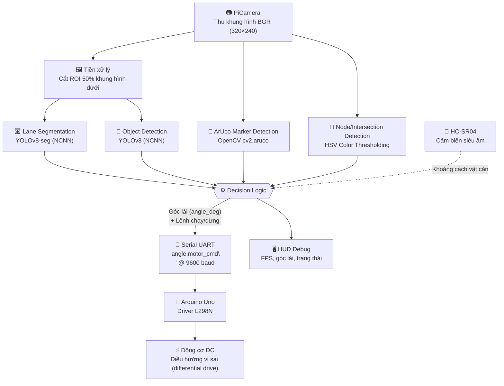

# 🚗 Self-Driving Mini Car — Raspberry Pi 4 & Computer Vision

<p align="center">
  <strong>Xe mini tự hành sử dụng thị giác máy tính thời gian thực để nhận diện làn đường, biển báo giao thông và né tránh vật cản trên nền tảng nhúng Raspberry Pi 4.</strong>
</p>

<p align="center">
  
  
  
  
</p>

<p align="center">
  
  
  
</p>

---

## 📑 Mục lục

1. [Giới thiệu](#-giới-thiệu)
2. [Kiến trúc hệ thống](#-kiến-trúc-hệ-thống)
3. [Tính năng nổi bật](#-tính-năng-nổi-bật)
4. [Công nghệ sử dụng](#-công-nghệ-sử-dụng)
5. [Cấu trúc thư mục](#-cấu-trúc-thư-mục)
6. [Cài đặt & Sử dụng](#-cài-đặt--sử-dụng)
7. [Demo / Kết quả](#-demo--kết-quả)
8. [Định hướng phát triển](#-định-hướng-phát-triển)
9. [Tác giả](#-tác-giả)

---

## 📖 Giới thiệu

**Self-Driving Mini Car** là một đồ án nghiên cứu khoa học độc lập (*solo research project*), được thiết kế, triển khai và tối ưu hoá toàn bộ bởi cá nhân tác giả — từ khâu lắp ráp phần cứng, huấn luyện mô hình thị giác máy tính, cho đến việc triển khai (deploy) hệ thống nhận thức (perception) và điều khiển (control) trong thời gian thực trên một thiết bị nhúng có tài nguyên tính toán hạn chế.

Mục tiêu cốt lõi của dự án là xây dựng một hệ thống **Edge AI** hoàn chỉnh, có khả năng:

- Thu nhận và xử lý luồng video trực tiếp từ camera gắn trên xe.
- Suy luận đồng thời hai mô hình học sâu (phân đoạn làn đường và phát hiện đối tượng) trên phần cứng không có GPU chuyên dụng.
- Chuyển hoá kết quả nhận thức thành tín hiệu điều khiển động cơ một cách ổn định, có độ trễ thấp.

Điểm nhấn kỹ thuật của dự án không chỉ nằm ở việc *huấn luyện mô hình chính xác*, mà quan trọng hơn là bài toán **tối ưu hoá và triển khai mô hình AI lên môi trường thực tế (Embedded/Edge AI deployment)** — nơi các ràng buộc về CPU, RAM và điện năng tiêu thụ buộc người thiết kế phải đánh đổi hợp lý giữa độ chính xác và tốc độ xử lý (FPS) để hệ thống có thể phản ứng theo thời gian thực.

## 🧠 Kiến trúc hệ thống

Hệ thống được thiết kế theo kiến trúc **Perception → Decision → Control**, với vòng lặp xử lý khép kín (closed-loop) chạy liên tục trên Raspberry Pi 4 và giao tiếp với vi điều khiển Arduino qua UART.



**Diễn giải luồng xử lý:**

1. **Thu thập dữ liệu:** `PiCamera2` chụp khung hình liên tục ở độ phân giải 320×240 (BGR888), được tối ưu để giảm tải cho bước suy luận phía sau.
2. **Nhận thức (Perception):**
   - **Lane tracking:** Vùng ảnh quan tâm (ROI — 50% nửa dưới khung hình) được đưa qua mô hình **YOLOv8-Segmentation** đã export sang **NCNN** để tìm biên dạng làn đường; toạ độ trọng tâm (centroid) của các vùng làn được dùng để suy ra điểm mục tiêu (target point).
   - **Object/Traffic-sign detection:** Toàn bộ khung hình được quét bởi mô hình **YOLOv8-Detect** để nhận diện biển báo và tín hiệu dừng (đèn đỏ/biển stop).
   - **ArUco marker detection:** Dùng để xác định các điểm mốc/đích đến trên sa hình, cho phép xe biết khi nào đã tới điểm dừng mục tiêu.
   - **Node detection:** Phân ngưỡng màu HSV (đỏ/xanh lá/vàng/xanh dương) để nhận diện các nút giao trên sa hình.
3. **Ra quyết định (Decision Logic):** Góc lái được tính bằng lượng giác (`atan2` giữa điểm mục tiêu và tâm khung hình), kết hợp với các cờ trạng thái (dừng vì biển báo, đã tới đích) để tạo ra một gói lệnh điều khiển duy nhất.
4. **Điều khiển (Control):** Gói lệnh dạng `"{angle},{run_flag}\n"` được gửi qua **Serial/UART** tới Arduino. Arduino ánh xạ góc lái thành các mức PWM khác biệt cho hai bên bánh (differential steering) thông qua module **L298N**, đồng thời tự động giảm tốc khi vào cua gắt.
5. **Tối ưu hiệu năng:** Tần suất suy luận của từng mô hình được điều tiết độc lập (frame-skipping: làn đường mỗi 2 khung hình, vật thể mỗi 5 khung hình) để cân bằng giữa độ trễ điều khiển và FPS thực tế trên CPU của Raspberry Pi 4.

## ✨ Tính năng nổi bật

- 🛣️ **Lane Tracking:** Kết hợp xử lý ảnh truyền thống (OpenCV — HSV, morphology, contour) với mô hình phân đoạn YOLOv8-seg để bám làn đường ổn định, tính toán góc lái theo thời gian thực.
- 🚦 **Traffic Sign & Signal Recognition:** Huấn luyện YOLOv8 tuỳ biến để nhận diện biển báo giao thông và đèn tín hiệu, tự động ra lệnh dừng xe khi phát hiện biển stop/đèn đỏ.
- 🧭 **ArUco Marker Navigation:** Nhận diện marker ArUco để xác định điểm đến (checkpoint) và tự động dừng khi xe đến đúng vị trí mục tiêu.
- 🎨 **Intersection/Node Detection:** Phân loại nút giao trên sa hình bằng ngưỡng màu HSV, hỗ trợ logic điều hướng tại các điểm rẽ.
- 🧱 **Obstacle Avoidance:** Cảm biến siêu âm HC-SR04 giám sát khoảng cách phía trước, cho phép hệ thống phản ứng và dừng/né vật cản ngoài phạm vi thị giác camera.
- ⚡ **Edge AI Model Optimization:** Chuyển đổi mô hình YOLOv8 (PyTorch) sang định dạng **NCNN** và **TFLite** nhằm giảm độ trễ suy luận và footprint bộ nhớ, giải quyết bài toán giới hạn tài nguyên trên thiết bị nhúng — trọng tâm kỹ thuật chính của dự án.
- 🎛️ **Adaptive Frame Skipping:** Cơ chế điều tiết tần suất suy luận riêng cho từng mô hình (lane vs. object) nhằm tối đa hoá FPS mà không đánh đổi độ an toàn điều khiển.
- 📊 **Real-time HUD Debugging:** Hiển thị trực quan góc lái (steering gauge), FPS và trạng thái vận hành ngay trên khung hình để phục vụ debug/đánh giá.

## 🛠️ Công nghệ sử dụng

| Nhóm | Công nghệ |
|---|---|
| **Ngôn ngữ** | Python 3.9+, C++ (Arduino/Wiring) |
| **Thị giác máy tính** | OpenCV (xử lý ảnh HSV, contour, ArUco), Ultralytics YOLOv8 |
| **Deep Learning Framework** | PyTorch (huấn luyện mô hình) |
| **Tối ưu hoá & Triển khai mô hình** | NCNN, TensorFlow Lite (`.tflite`) — Edge AI inference |
| **Phần cứng chính** | Raspberry Pi 4 Model B, PiCamera |
| **Điều khiển động cơ** | Arduino Uno/Nano, Module cầu H L298N |
| **Cảm biến** | HC-SR04 (siêu âm — phát hiện/né vật cản) |
| **Giao tiếp** | UART/Serial (PySerial) giữa Raspberry Pi và Arduino |

## 📂 Cấu trúc thư mục

```
self-driving-car-pi4/
├── config/
│   └── settings.py            # Cấu hình đường dẫn mô hình, kích thước khung hình, tham số tối ưu FPS
├── control/
│   ├── serial_comm.py         # Khởi tạo & gửi lệnh điều khiển qua UART
│   └── steering.py            # Logic tính toán góc lái từ toạ độ làn đường
├── perception/
│   ├── lane_detection.py      # Suy luận YOLOv8-seg + tính điểm mục tiêu bám làn
│   ├── node_detection.py      # Phát hiện nút giao (HSV) & marker ArUco
│   └── object_detection.py    # Suy luận YOLOv8-detect, nhận diện biển báo/tín hiệu dừng
├── utils/
│   └── visualization.py       # Vẽ HUD debug (steering gauge, FPS, trạng thái)
├── hc_SR04vaServo.ino         # Firmware Arduino: đọc lệnh Serial, điều khiển L298N, giám sát HC-SR04
├── main.py                    # Điểm khởi chạy: vòng lặp Perception → Decision → Control
├── requirements.txt
└── README.md
```

## 🚀 Cài đặt & Sử dụng

### 1. Yêu cầu phần cứng

- Raspberry Pi 4 Model B (khuyến nghị ≥ 4GB RAM), thẻ nhớ microSD ≥ 32GB, cài **Raspberry Pi OS (64-bit, Bullseye/Bookworm)**.
- Module camera **PiCamera** (v2/v3) kết nối qua cổng CSI.
- Board **Arduino Uno/Nano**, module cầu H **L298N**, cảm biến siêu âm **HC-SR04**.
- Khung xe, 2–4 động cơ DC giảm tốc, nguồn pin (pin Li-ion/pin sạc dự phòng).
- Dây cáp USB Raspberry Pi ↔ Arduino để giao tiếp Serial.

### 2. Thiết lập môi trường trên Raspberry Pi

```bash
# Cập nhật hệ thống
sudo apt update && sudo apt upgrade -y

# Cài đặt các gói hệ thống cần thiết cho picamera2 & OpenCV
sudo apt install -y python3-pip python3-venv python3-opencv libatlas-base-dev

# Clone repository
git clone https://github.com/phamquoctuan2308/self-driving-car-pi4.git
cd self-driving-car-pi4

# Tạo và kích hoạt môi trường ảo
python3 -m venv venv
source venv/bin/activate

# Cài đặt thư viện Python
pip install --upgrade pip
pip install -r requirements.txt
```

### 3. Cấu hình dự án

Mở [config/settings.py](config/settings.py) và cập nhật đường dẫn tới các mô hình đã export (NCNN) cho đúng với môi trường của bạn:

```python
lane_model_path = "/path/to/your/seg_ncnn_model"     # Mô hình YOLOv8-seg (lane) sau khi export NCNN
obj_model_path  = "/path/to/your/detect_ncnn_model"  # Mô hình YOLOv8-detect (biển báo) sau khi export NCNN
serial_port     = "/dev/ttyUSB0"                      # Cổng Serial kết nối Arduino (kiểm tra bằng `ls /dev/tty*`)
```

> 💡 Để export mô hình YOLOv8 đã huấn luyện sang NCNN nhằm tối ưu tốc độ suy luận trên Raspberry Pi:
> ```bash
> yolo export model=best.pt format=ncnn
> ```

### 4. Nạp firmware cho Arduino

Mở [hc_SR04vaServo.ino](hc_SR04vaServo.ino) bằng Arduino IDE, kiểm tra lại sơ đồ chân (ENA/IN1/IN2, ENB/IN3/IN4 nối tới L298N) và nạp chương trình vào board Arduino qua cổng USB.

### 5. Chạy chương trình

```bash
python main.py
```

Chương trình sẽ yêu cầu nhập **ID của marker ArUco đích** (điểm dừng), sau đó khởi động camera và vòng lặp điều khiển thời gian thực. Nhấn phím `q` trên cửa sổ hiển thị để dừng chương trình an toàn.

## 🖼️ Demo / Kết quả

<p align="center">
  <em>Hình ảnh/GIF minh hoạ xe vận hành thực tế trên sa hình sẽ được cập nhật tại đây.</em>
</p>


*Hình 1: Xe tự động bám làn đường theo thời gian thực bằng YOLOv8-seg.*


*Hình 2: Xe phát hiện biển báo/đèn đỏ và tự động dừng.*


*Hình 3: Phản ứng né tránh vật cản bằng cảm biến siêu âm HC-SR04.*


*Hình 4: Biểu đồ so sánh FPS suy luận trước và sau khi tối ưu hoá mô hình bằng NCNN/TFLite trên Raspberry Pi 4.*

## 🔭 Định hướng phát triển

- [ ] Bổ sung bộ lọc Kalman/PID cho tín hiệu góc lái nhằm tăng độ mượt khi bám làn.
- [ ] Huấn luyện lại mô hình phát hiện biển báo trên tập dữ liệu đa dạng hơn (điều kiện ánh sáng, góc chụp).
- [ ] Benchmark định lượng FPS/độ trễ giữa PyTorch (.pt), NCNN và TFLite trên cùng một mô hình.
- [ ] Tích hợp hợp nhất cảm biến (sensor fusion) giữa camera và HC-SR04 cho bài toán né vật cản.
- [ ] Container hoá môi trường triển khai (Docker) để tái lập kết quả dễ dàng hơn.

## 👤 Tác giả

**Phạm Quốc Tuấn**
Dự án nghiên cứu khoa học độc lập — thiết kế, triển khai và tối ưu hoá toàn bộ hệ thống.

- GitHub: [@phamquoctuan2308](https://github.com/phamquoctuan2308)
- Email: liên hệ qua GitHub profile

---

<p align="center"><sub>Dự án được xây dựng với mục đích học thuật/nghiên cứu, phục vụ hồ sơ ứng tuyển vị trí AI Engineer Intern.</sub></p>
